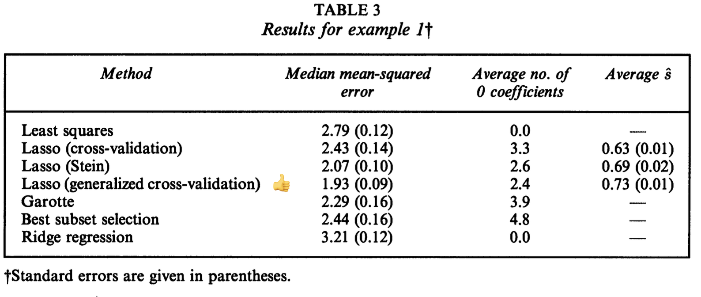
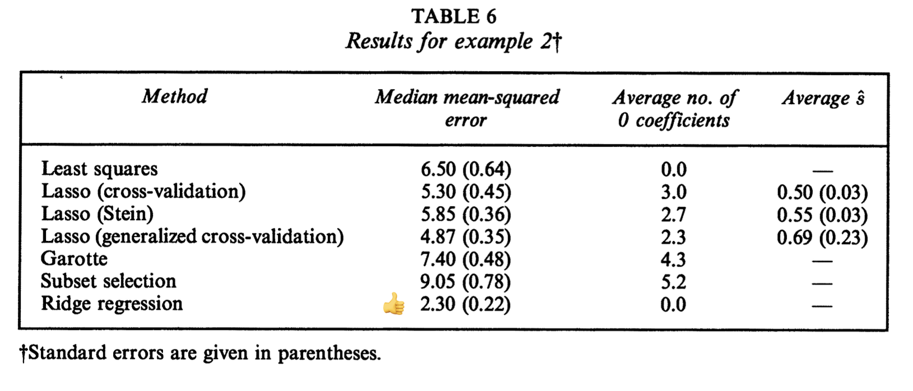
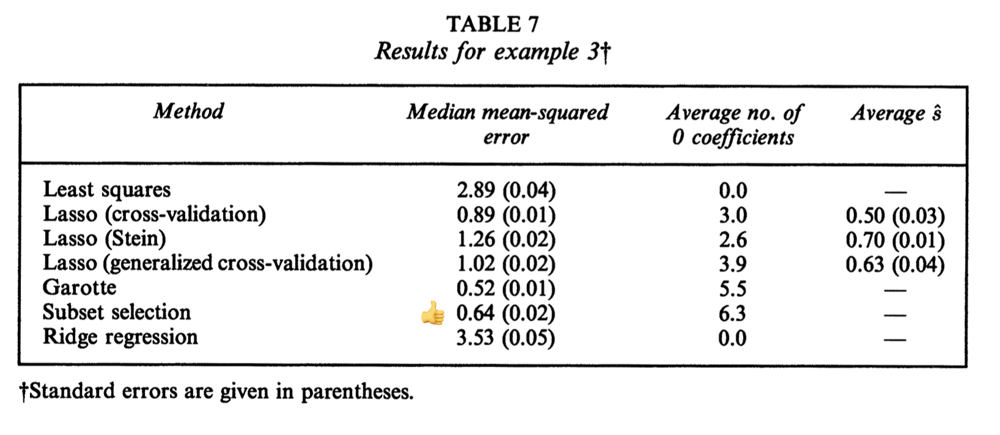
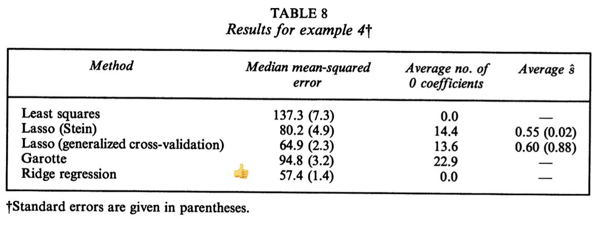

```{r setup, include=FALSE}
knitr::opts_chunk$set(echo = FALSE)
```

## The LASSO

Def. the data $(\mathbf{x}_i, y_i)$, $i = 1,2,...,N$
where $\mathbf{x}_{ij}$ are standardized, s.t. $\frac{1}{N}\sum_i X_{ij} = 0$, $\frac{1}{N}\sum_i X_{ij}^2 = 1$
Let $\hat{\boldsymbol{\beta}} = (\hat{\beta}_1, ..., \hat{\beta}_p)^T$, the LASSO estimate $(\hat{\alpha}, \hat{\boldsymbol{\beta}})$:

\begin{equation}
(\hat{\alpha}, \hat{\boldsymbol{\beta}}) := \arg\min \left\{ \sum_{i=1}^N (y_i - \alpha - \sum_j \beta_j x_{ij})^2 \right\} \text{ s.t. } \sum_j|\beta_i| \leq t
\end{equation}

where $t \geq 0$ is tuning parameters.

$\hat\alpha = \bar{y}$ for all $t$, WLOG, set $\bar{y} = 0$ hence we can omit $\alpha$.

## The LASSO

The problem becomes:

\begin{equation}
\boldsymbol{\hat\beta} := \arg\min \left\{ \sum_{i=1}^N (y_i - \sum_j \beta_j x_{ij})^2 \right\} \text{ s.t. } \sum_j|\beta_j| \leq t
\end{equation}

\begin{align*}
\hat{\boldsymbol{\beta}} & := \arg\min_{\boldsymbol{\beta}} \left( (Y-X\boldsymbol{\beta})^T(Y- X\boldsymbol{\beta}) + \lambda || \boldsymbol{\beta}|| \right) \\
& = \arg\min_{\boldsymbol{\beta}} \left( -Y^T X\boldsymbol{\beta} + \frac{1}{2} \boldsymbol{\beta}^T X^T X \boldsymbol{\beta} + \gamma ||\boldsymbol{\beta}|| \right)
\end{align*}

## Orthogonal Design Case

$X$ is orthogonal, i.e., $X^T X = I$, and then $\hat{\boldsymbol\beta}^o = X^T Y$.
\begin{align*}
& \min_{\boldsymbol{\beta}} \quad -Y^T X\boldsymbol{\beta} + \boldsymbol{\beta}^T X^T X \boldsymbol{\beta} + \gamma ||\boldsymbol{\beta}|| \\
\Rightarrow & \min_{\boldsymbol{\beta}} \quad -\hat{\boldsymbol{\beta}}^o \boldsymbol{\beta} + \frac{1}{2} \boldsymbol{\beta}^T \boldsymbol{\beta} + \gamma ||\boldsymbol{\beta}|| \\
\Rightarrow & \min_{\boldsymbol{\beta}} \quad \sum_{i=1}^p -\hat{\boldsymbol{\beta}}^o \boldsymbol{\beta} + \frac{1}{2} \beta_i^2 + \gamma |\beta_i|
\end{align*}

For a certain $i$, the Lagrangian function is 

\begin{equation}
\mathcal{L}_i = -\hat{\boldsymbol{\beta}}^o \boldsymbol{\beta} + \frac{1}{2} \beta_i^2 + \gamma |\beta_i|
\end{equation}

If $\hat{\beta}_i^o > 0$, then we must have $\beta_i \geq 0$, since if $\beta_i < 0$, $\mathcal{L}_i$ cannot be minimized. 
Likewise, if $\hat{\beta}_i^o < 0$, $\beta_i \leq 0$.


## Derivation

### \underline{Case 1: $\hat\beta_i^o$ >0}

Since $\beta_i \geq 0$,

$$
\mathcal{L}_i = -\beta_i^o \beta_i + \frac{1}{2} \beta_i^2 + \gamma \beta_i
$$

Taking the first-order condition, we get

$$
\frac{\partial \mathcal{L}_i}{\partial \beta_i} = -\hat{\beta}_i^o + \beta_i +\gamma = 0
$$

This gives us

\begin{align*}
\hat{\beta}_i^{lasso} &= 
\begin{cases} 
\hat{\beta}_i^o - \gamma & \text{if } \hat{\beta}_i^o - \gamma \geq 0, \\
0 & \text{otherwise.}
\end{cases} \\
&= (\hat\beta_i^o - \gamma )^+ \\
&= \text{sgn}(\hat\beta_i^o) (|\hat \beta_i^o | - \gamma)^+
\end{align*}


## Derivation

### \underline{Case 2: $\hat\beta_i^o <$ 0}

Since $\beta_i \leq 0$,

$$
\mathcal{L}_i = -\beta_i^o \beta_i + \frac{1}{2} \beta_i^2 - \gamma \beta_i
$$

Taking the first-order condition, we get

$$
\frac{\partial \mathcal{L}_i}{\partial \beta_i} = -\hat{\beta}_i^o + \beta_i -\gamma = 0
$$

This gives us

\begin{align*}
\hat{\beta}_i^{lasso} &= 
\begin{cases} 
\hat{\beta}_i^o + \gamma & \text{if } \hat{\beta}_i^o + \gamma \leq 0, \\
0 & \text{otherwise.}
\end{cases} \\
&= (- \hat\beta_i^o - \gamma )^+ \\
&= \text{sgn}(\hat\beta_i^o) (|\hat \beta_i^o | - \gamma)^+
\end{align*}

## 2.5. Standard Errors - Bootstrap
In general, LASSO estimator is a non-linear and non-differentiable function. It's difficult to obtain an accurate estimate of its SE.  
One way to to get the SE is by bootstrap.

Let $Z_i = (x_i, y_i)$, $i = 1, \dots, n$. The steps for calculating the LASSO bootstrap standard error are as follows. First, pick a large number $B$, and for $b = 1,\dots, B$:

-   Draw a bootstrap sample ($\tilde{Z}_1^{(b)}, \dots, \tilde{Z}_n^{(b)}$) from ($Z_1, \dots, Z_n$).
-   Perform LASSO and get the estimated coefficients $\tilde{\boldsymbol{\beta}}^{(b)}$ on ($\tilde{Z}_1^{(b)}, \dots, \tilde{Z}_n^{(b)}$).
-   Then we estimate the standard error of $\tilde{\boldsymbol{\beta}}^{(b)}$ as follows:

$$
SE(\tilde{\boldsymbol{\beta}}^{(b)}) = \sqrt{\frac{1}{B} \sum_{b=1}^{B} \left(\tilde{\beta}^{(b)} - \frac{1}{B} \sum_{r=1}^{B} \tilde{\beta}^{(r)}\right) \left(\tilde{\beta}^{(b)} - \frac{1}{B} \sum_{r=1}^{B} \tilde{\beta}^{(r)}\right)^T}
$$


## 2.5. Standard Errors - Approximate Form

We rewrite the penalty constraint for the LASSO problem as

\begin{equation}
\boldsymbol{\hat\beta} := \arg\min \left\{ \sum_{i=1}^N \left(y_i - \sum_j \beta_j x_{ij}\right)^2 \right\} \text{ s.t. } \frac{\sum_j|\beta_j|^2}{|\beta_j|}\leq t
\end{equation}

Hence, at the lasso estimate, we may approximate the solution by a ridge regression of the form $\boldsymbol{\beta}^* = (\boldsymbol{X}^T\boldsymbol{X} + \lambda \boldsymbol{W}^{-1} )^{-1} \boldsymbol{X}^T \boldsymbol{Y}$.  


where $\boldsymbol{W} = \text{diag}(|\hat\beta_j^{lasso}|)$, and $\boldsymbol{W}^{-1}$ denotes the generalized inverse of $\boldsymbol{W}$.
The covariance matrix of the estimates may then be approximated by

\begin{equation}
(\boldsymbol{X}^T\boldsymbol{X} + \lambda \boldsymbol{W}^{-1})^{-1} \boldsymbol{X}^T\boldsymbol{X} (\boldsymbol{X}^T\boldsymbol{X} + \lambda \boldsymbol{W}^{-1})^{-1} \hat\sigma^2
\end{equation}


## 4. Prediction error and estimation of t

There are three methods:
1. cross- validation
2. generalized cross-validation
3. Stein's unbiased risk estimation (SURE)

## Cross-validation

Suppose $Y = \eta(X) + \epsilon$ where $E(\epsilon) = 0$, $Var(\epsilon) = \sigma^2$. The mean-squared error of estimate $\hat{\eta}(X)$ is defined by 

$$
ME = E(\hat{\eta}(X) - \eta(X))^2
$$

and the prediction error is 

\begin{equation}
PE = E(Y-\hat{\eta}(X))^2 = ME + \sigma^2
\end{equation}

### In LASSO

$\eta(X) = X \boldsymbol{\beta}$ is a linear model, the ME has a simple form:

$$
ME = (\hat{\boldsymbol{\beta}} - \boldsymbol{\beta})^T V (\hat{\boldsymbol{\beta}} - \boldsymbol{\beta})
$$

where $V$ is the population covariance matrix of $X$.

## Generalized cross-validation

We approximate the lasso solution by a ridge regression of the form

\begin{equation}
\boldsymbol{\beta}^* = (X^T X + \lambda W^{-1})^{-1} X^T Y
\end{equation}

Therefore the number of effective parameters in the constrained fit $\boldsymbol{\beta}^*$ may be approximated by 

\begin{equation}
\rho(t) = tr \left( X (X^T X + \lambda W^{-1})^{-1} X^T \right)
\end{equation}

Letting $rss(t)$ be the residual sum of squares for the constrained fit with constraint $t$, we construct the generalized cross-validation style statistic

\begin{equation}
GCV(t) = \frac{1}{N} \frac{rss(t)}{(1-\frac{\rho(t)}{N})^2}
\end{equation}

## Stein's Unbiased Risk Estimation (SURE)

Let $\hat{\boldsymbol{\mu}}$ be the estimator of $\boldsymbol{\mu}$. write $\hat{\boldsymbol{\mu}} = \boldsymbol{z}+g(\boldsymbol{z})$,
where $g$ is an almost differentiable function from $\mathbb{R}^p \rightarrow \mathbb{R}^p$.

\begin{align}
\mathbb{E}_\mu ||\hat{\boldsymbol{\mu}} -\boldsymbol{\mu} ||^2 & = p + \mathbb{E}_\mu\left(||g(\boldsymbol{z})||^2 + 2 \sum_{i=1}^p \frac{dg_i}{dz_i}\right)
\end{align}

Denotes the estimated standard error of $\hat \beta_j^o$ by
\begin{align*}
SE(\hat{\beta}^o_j) &= \hat{\tau} := \frac{\hat{\sigma}}{\sqrt{n}}, \hat{\sigma}^2 = \frac{\sum_{i=1}^N(y_i - \hat{y}_i)^2}{N-p}
\end{align*}

We may derive the formula as an approximately unbiased estimate of the risk:
\begin{equation}
R(\hat{\boldsymbol{\beta}}(\gamma)) \approx \hat{\tau}^2 \left\{p - 2 \# \left(j: \frac{|\hat{\beta}_j^o|}{\hat{\tau}} < \gamma\right) + \sum_{j=1}^p \max \left(\left|\frac{\hat{\beta}_j^o}{\hat{\tau}}\right|, \gamma\right)^2\right\}
\end{equation}

## Stein's Unbiased Risk Estimation (SURE)
$$
R(\hat{\boldsymbol{\beta}}(\gamma)) \approx \hat{\tau}^2 \left\{p - 2 \# \left(j: \frac{|\hat{\beta}_j^o|}{\hat{\tau}} < \gamma\right) + \sum_{j=1}^p \max \left(\left|\frac{\hat{\beta}_j^o}{\hat{\tau}}\right|, \gamma\right)^2\right\}
$$

where $\hat{\beta}_j(\gamma) = \text{sgn}(\hat{\beta}_j^o) \left(\left|\frac{\hat{\beta}_j^o}{\hat{\tau}}\right| - \gamma\right)^+$

Hence an estimate of $\gamma$ can be obtained as the minimizer of $R(\hat{\boldsymbol{\beta}}(\gamma))$
$$
\hat{\gamma} = \arg\min_{\gamma \geq 0} R(\hat{\boldsymbol{\beta}}(\gamma))
$$
From this we obtian an estimate of the lasso parameter t:
$$
\hat{t} = \sum_{j=1}^p ( |\hat{\beta}_j^o| - \hat{\gamma} ) ^+
$$


## 6. Algorithms for Finding LASSO Solutions

We fix $t \geq 0$,
\begin{align*}
(\hat{\alpha}, \hat{\boldsymbol{\beta}}) &:= \arg\min \left\{ \sum_{i=1}^N (y_i - \alpha - \sum_j \beta_j x_{ij})^2 \right\} \text{ s.t. } \sum_j|\beta_i| \leq t \\
\\
\hat{\boldsymbol{\beta}} & = \arg\min \left\{ \sum_{i=1}^N \left(y_i - \sum_j \beta_j x_{ij}\right)^2 \right\} \text{ s.t. } \delta_i^T \boldsymbol{\beta} \leq t
\end{align*}

where $\boldsymbol{\delta}_i = (\pm1, \pm1, ..., \pm1) , i =1, 2,..., m$ be the $p$-tuples.

For a given $\boldsymbol{\beta}$, let equality set $E = \{i : \boldsymbol{\delta}_i^T \boldsymbol{\beta} = t\}$ and slack set $S = \{i : \boldsymbol{\delta}_i^T \boldsymbol{\beta}< t\}$


## 6. Algorithms for Finding LASSO Solutions

The algorithms starts with $E = \{i_0\}$  where $\boldsymbol{\delta}_{i0} = \text{sign}(\hat{\boldsymbol{\beta}}^o)$, $\hat{\boldsymbol{\beta}}^o$ being the overall LS estimate.

Find $\hat{\beta}$ to minimize $\sum_{i=1}^N (y_i - \sum_j \beta_j x_{ij})^2$ s.t. $\delta_{i0}^T \boldsymbol{\beta} \leq t$

While $\sum |\hat{\boldsymbol{\beta}}_j| >t$ :

|           add $i$ to the set $E$ where $\boldsymbol{\delta}_i = \text{sign} (\hat{\boldsymbol{\beta}})$

|           Find $\hat{\boldsymbol{\beta}}$ to minimize $g(\boldsymbol{\beta})$ s.t. $G_E \boldsymbol{\beta} \leq t \boldsymbol{1}$

end  
Where $G_E$ is the matrix whose rows are $\delta_i$ for $i \in E$

## 7. Simulation 
The author gave us four examples:

### Example 1
Simulated 50 data sets consisting of 20 observations from the model
$$
y = \boldsymbol{\beta}^T \boldsymbol x + \sigma \epsilon
$$
where $\boldsymbol\beta = (3, 1.5, 0, 0, 2, 0, 0, 0)^T$ and $\epsilon \sim N(0,1)$
The correlation between $x_i$ and $x_j$ was $\rho^{|i-j|}$ with $\rho =0.5$ and set $\sigma=3$ 

### Example 2
Same model setting as example 1, but with $\beta_j =0.85, \forall j \text{ and } \sigma = 3$

### Example 3
Same model setting as example 1, but with $\boldsymbol\beta = (5,0,0,0,0,0,0,0) \text{ and } \sigma = 2$


## 7. Simulation

### Example 4
Simulated 50 data sets each having 100 observations and 40 variables. We defind predictor $x_{ij} = z_{ij} + z_{i}$ where $z_{ij}$ and $z_{i}$ are independent standard normal variates. This induced a pairwise correlation of 0.5 among the predictors. The coefficient vector was $\boldsymbol{\beta} = (0,0,\dots,0, 2,2,\dots,2,0,0,\dots,0,2,2,\dots,2)$, there being 10 repeats in each block.Finally, we defined $y = \boldsymbol{\beta}^T\boldsymbol{x} +15 \epsilon$ where $\epsilon$ was standard normal.


## Models Performance

### Example 1

```{r echo=FALSE}

```

## Models Performance

### Example 2

```{r echo=FALSE}

```

## Models Performance

### Example 3

```{r echo=FALSE}

```

## Models Performance

### Example 4

```{r echo=FALSE}

```

## Discussion

The author examined the relative merits of the methods in three different scenarios:

1.  **small number of large effects** -- subset selection does best here the lasso not quite as well and ridge does quite poorly.
2.  **small to moderate number of moderate-sized effects** -- the lasso does best, followed by ridge and then subset selection.
3.  **large number of samll effects** -- ridge does best by a good margin, followed by the lasso and then subset selection.

# Thank you 
